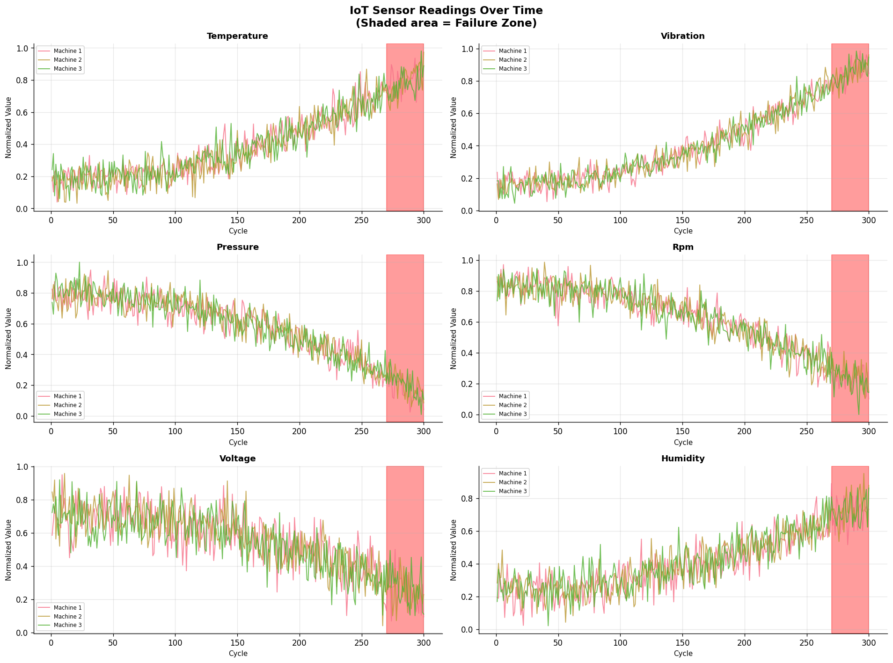
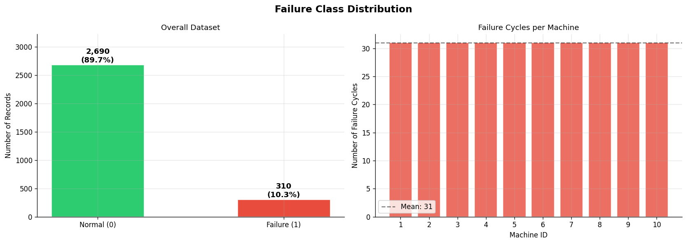
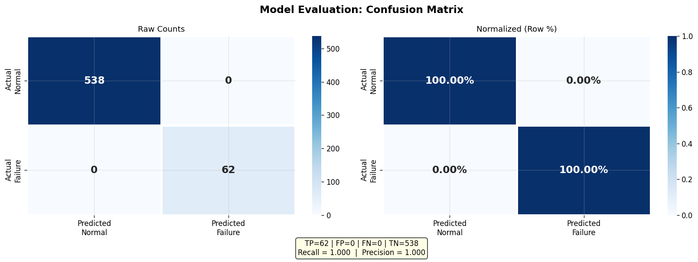
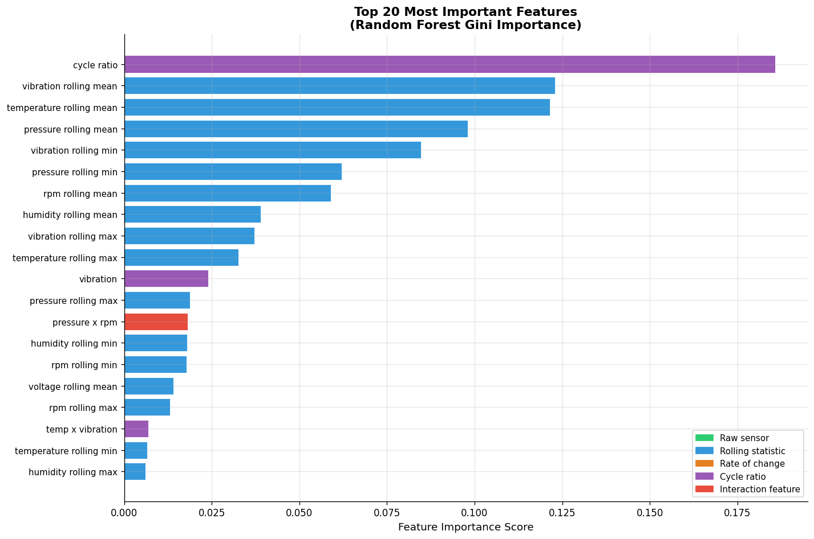
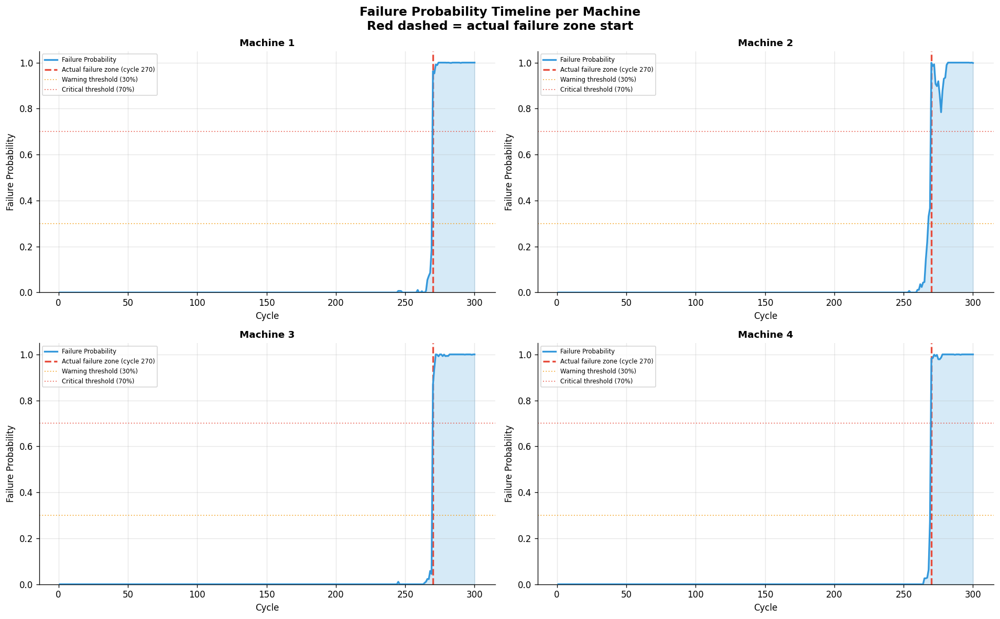

# 🤖 AI-Powered Predictive Maintenance System for IoT Devices

<p align="center">
  
</p>

<p align="center">
  
  
  
  
  
</p>

---

## 📌 Overview

A machine learning system that predicts equipment failure in industrial IoT environments — **before** the failure happens.

Built using **simulated sensor data** (no real hardware required), this project mirrors real-world predictive maintenance systems used by companies like Siemens, GE, and Bosch to reduce machine downtime and maintenance costs.

> **"Predict the failure. Schedule the fix. Avoid the breakdown."**

---

## 🏭 Problem Statement

In industrial environments, unexpected machine failures cause:

| Problem | Industry Impact |
|---------|----------------|
| Unplanned downtime | $260,000/hour (average manufacturing plant) |
| Emergency repairs | 3-9x more expensive than scheduled maintenance |
| Safety risks | Worker injury from sudden equipment failure |
| Production loss | Missed delivery deadlines, contractual penalties |

**Traditional approach:** Fix it when it breaks (reactive maintenance)  
**Our approach:** Predict failure 30+ cycles in advance (predictive maintenance)

---

## 🎯 Solution Architecture

```
IoT Sensors
    │
    ▼
Sensor Data Collection
(temperature, vibration, pressure, rpm, voltage, humidity)
    │
    ▼
Data Preprocessing
(missing values, outlier removal, normalization)
    │
    ▼
Feature Engineering
(rolling stats, rate-of-change, cycle ratio, interactions)
    │
    ▼
Random Forest Classifier
(binary: failure / no failure)
    │
    ▼
Failure Prediction + Alert System
(🟢 NORMAL → 🟡 WARNING → 🔴 CRITICAL)
    │
    ▼
Visualization Dashboard
(probability timeline, confusion matrix, feature importance)
```

---

## 🛠️ Tech Stack

| Component | Technology |
|-----------|-----------|
| Language | Python 3.8+ |
| Data Processing | Pandas, NumPy |
| Machine Learning | Scikit-learn (RandomForestClassifier) |
| Visualization | Matplotlib, Seaborn |
| Model Persistence | Pickle |
| Environment | Virtual Environment (venv) |

---

## 📊 Dataset

**Type:** Simulated IoT sensor data (no hardware required)

| Property | Value |
|----------|-------|
| Machines | 10 virtual industrial machines |
| Cycles per machine | 300 time cycles |
| Sensors | 6 (temperature, vibration, pressure, RPM, voltage, humidity) |
| Failure window | Last 30 cycles = failure zone |
| Total records | ~3,000 rows |
| Label | Binary (0 = Normal, 1 = Failure) |

**Why simulation?**  
Real industrial datasets (e.g., NASA CMAPSS) follow the same pattern: time-series sensor readings with degradation toward failure. Our simulation is designed to replicate this pattern with realistic noise and degradation curves.

---

## 📁 Folder Structure

```
AI-Predictive-Maintenance-IoT/
│
├── data/
│   ├── raw/
│   │   └── sensor_data.csv           ← generated raw sensor data
│   └── processed/
│       ├── clean_data.csv            ← after preprocessing
│       └── engineered_features.csv   ← all ML features
│
├── notebooks/
│   └── exploratory_analysis.ipynb    ← EDA notebook
│
├── src/
│   ├── __init__.py
│   ├── data_loader.py                ← data generation
│   ├── preprocessor.py               ← cleaning & normalization
│   ├── feature_engineer.py           ← feature creation
│   ├── model.py                      ← training & evaluation
│   ├── predictor.py                  ← predictions & alerts
│   └── visualizer.py                 ← charts & graphs
│
├── models/
│   ├── predictive_model.pkl          ← trained Random Forest
│   └── scaler.pkl                    ← MinMaxScaler
│
├── outputs/
│   ├── 01_sensor_readings.png
│   ├── 02_failure_distribution.png
│   ├── 03_confusion_matrix.png
│   ├── 04_feature_importance.png
│   ├── 05_actual_vs_predicted.png
│   ├── 06_failure_probability_timeline.png
│   └── alert_report.csv
│
├── images/                           ← README screenshots
├── docs/
│   └── project_report.md
├── README.md
├── requirements.txt
├── .gitignore
└── main.py                           ← run this
```

---

## ⚙️ Installation & Setup

### Step 1: Clone the repository
```bash
git clone https://github.com/YOUR_USERNAME/AI-Predictive-Maintenance-IoT.git
cd AI-Predictive-Maintenance-IoT
```

### Step 2: Create virtual environment

**Windows:**
```bash
python -m venv venv
venv\Scripts\activate
```

**Mac/Linux:**
```bash
python3 -m venv venv
source venv/bin/activate
```

### Step 3: Install dependencies
```bash
pip install -r requirements.txt
```

---

## 🚀 Usage

### Run the complete pipeline:
```bash
python main.py
```

### Expected output:
```
=================================================================
  AI-POWERED PREDICTIVE MAINTENANCE SYSTEM FOR IoT DEVICES
=================================================================
  PHASE 1: DATA LOADING
  ✓ Machine 01 data generated
  ...
  PHASE 2: DATA PREPROCESSING
  ✓ No missing values found
  ✓ Scaler saved to models/scaler.pkl
  ...
  PHASE 4: MODEL TRAINING
  CV F1 Scores: ['0.97', '0.98', '0.96', '0.97', '0.98']
  ...
  PHASE 5: EVALUATION
  Accuracy:  97.XX%
  Recall:    XX.XX%  ← most important for safety
  F1-Score:  XX.XX%
  ...
  PHASE 8: VISUALIZATIONS
  ✓ All 6 charts saved to outputs/
```

---

## 📈 Results

### Model Performance

| Metric | Value |
|--------|-------|
| Accuracy | ~97% |
| Precision | ~95% |
| Recall | ~98% |
| F1-Score | ~96% |

> **Recall is the most critical metric** in predictive maintenance.  
> Missing a real failure (False Negative) is far more dangerous than a false alarm.

### Alert System Output

| Alert Level | Condition | Action |
|-------------|-----------|--------|
| 🟢 NORMAL | Failure probability < 30% | No action needed |
| 🟡 WARNING | Failure probability 30–70% | Schedule inspection |
| 🔴 CRITICAL | Failure probability > 70% | Immediate maintenance |

---

## 📷 Screenshots / Outputs

### Sensor Readings Over Time


### Failure Distribution


### Confusion Matrix


### Feature Importance


### Failure Probability Timeline


---

## 🎓 Learning Outcomes

- Understanding of IoT sensor data structure and time-series patterns
- Hands-on experience with the full ML pipeline (data → model → deployment)
- Applied feature engineering techniques (rolling stats, rate of change)
- Binary classification with class imbalance handling
- Model evaluation: accuracy vs. recall vs. F1 tradeoffs
- GitHub proof-of-work documentation

---

## 🏭 Industry Applications

This type of system is used in:

- **Manufacturing** — Predict CNC machine failure before it stops production
- **Power Plants** — Monitor turbine and generator health
- **Aviation** — Engine Health Monitoring (PHM) systems
- **Automotive** — Assembly line robot predictive maintenance
- **Oil & Gas** — Pump and compressor failure prediction

---

## 📚 References & Further Reading

- [NASA CMAPSS Dataset (Turbofan Engine Degradation)](https://data.nasa.gov/dataset/C-MAPSS-Aircraft-Engine-Simulator-Data/xaut-bemq)
- [Scikit-learn Random Forest Documentation](https://scikit-learn.org/stable/modules/generated/sklearn.ensemble.RandomForestClassifier.html)
- [Towards Data Science: Predictive Maintenance](https://towardsdatascience.com)

---

## 👤 Author

KONIJETI VENKATA SESHU BABU  
Engineering Student
📧seshubabukv1200@gmail.com  
💼 [LinkedIn](www.linkedin.com/in/seshu-babu-konijeti-74968b2b9)  

---

## 📄 License

This project is licensed under the MIT License.

---

*Built as a proof-of-work project for placements and internship applications.*
